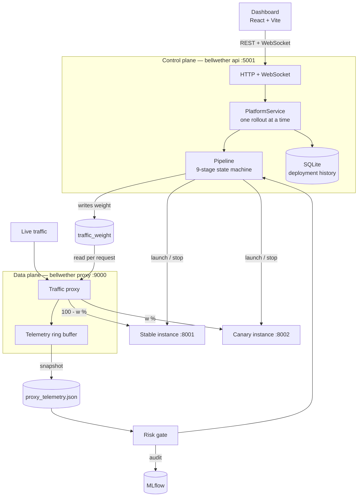
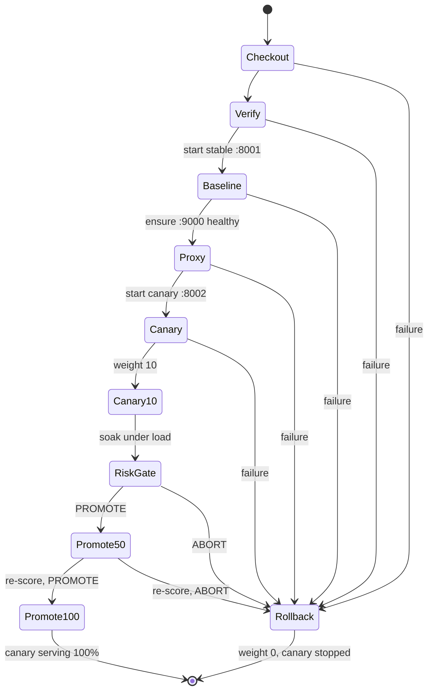

# Bellwether — Architecture

> Supersedes the v2 specification, which described a Jenkins-driven system.
> Jenkins is gone; there is no `Jenkinsfile`, no `wfapi`, and no external build
> controller. Orchestration is a Python state machine in this repository.

---

## 1. Shape of the system

Two planes, deliberately separate processes.



**Why the proxy is a separate process.** It is the data plane. Restarting the
control plane to deploy a fix must not drop live traffic. The two communicate
only through two files — the traffic weight and the telemetry snapshot — both
written atomically.

---

## 2. Modules

| Module | Responsibility |
|---|---|
| `config` | Typed settings, validated once at startup |
| `security` | Repository URL validation, HMAC and bearer authentication |
| `processes` | Subprocess and process-group management. Never a shell |
| `launcher` | Runtime detection and isolated application launch |
| `manifest` | `.bellwether.yml` and operator-side launch specs |
| `proxy` | Weighted traffic proxy; the only source of telemetry |
| `telemetry` | Thread-safe ring buffer, atomically persisted |
| `risk` | The scoring engine. Pure: samples in, decision out |
| `tracking` | MLflow audit trail. Optional and failure-tolerant |
| `store` | SQLite deployment history with schema versioning |
| `pipeline` | The rollout state machine |
| `service` | Coordination and the one-rollout-at-a-time rule |
| `api` | HTTP and WebSocket surface |

The dependency direction is strictly inward: `api → service → pipeline → {launcher,
risk, proxy primitives}`. Nothing below `service` imports Flask, which is what
makes the pipeline and the risk gate unit-testable.

---

## 3. Rollout state machine



**Ordering invariant.** Baseline precedes proxy, which precedes canary, which
precedes any traffic shift. A canary without a baseline is not a canary, and a
traffic shift without a proxy to route it is not a shift. Enforced by tests over
the stage catalogue, not by convention.

**Rollback invariant.** Every terminal path that is not "promoted to 100%" runs
`_rollback` from a `finally` block: weight to 0, canary stopped, run recorded.
Stage failure, operator abort, risk gate, and unexpected exceptions all converge
there. Traffic is never left mid-shift.

**Re-scoring at 50%.** Load-dependent regressions do not appear at 10%.
Promoting to 100% from a single 10% measurement would be promoting on stale
evidence, so the gate runs again after the split widens.

---

## 4. Traffic routing

The proxy reads the weight on every request and decides a cohort:

```python
if sticky and cookie_cohort in ("stable", "canary"):
    if cookie_cohort == "canary" and weight <= 0:   return "stable", REPIN
    if cookie_cohort == "stable" and weight >= 100: return "canary", REPIN
    return cookie_cohort, KEEP

if weight <= 0:    return "stable", SET
if weight >= 100:  return "canary", SET
return ("canary" if SystemRandom().randint(1, 100) <= weight else "stable"), SET
```

Two subtleties that a naive implementation gets wrong:

- **Withdrawal repins.** When the weight drops to 0 the canary no longer exists,
  so a pinned client is moved to stable *and re-cookied*. Leaving the old cookie
  in place would carry a stale pin for its whole lifetime.
- **Internal endpoints are not traffic.** `/__bellwether/health` and
  `/__bellwether/metrics` are served directly and excluded from telemetry, so
  dashboard polling cannot dilute the sample the risk gate scores.

Response headers `X-Bellwether-Target` and `X-Bellwether-Latency` make routing
observable from any HTTP client.

---

## 5. Risk gate

```
canary_p95   = percentile(canary_latencies, 0.95)   # linear interpolation
canary_errors = count(status >= 500) / count        # 4xx is the client's fault

ABORT if canary_p95 > LATENCY_P95_THRESHOLD_MS
     or canary_errors > ERROR_RATE_THRESHOLD
PROMOTE otherwise
```

Telemetry is trusted only when all three hold:

1. the snapshot file exists,
2. it was written within `MAX_TELEMETRY_AGE_S`,
3. it contains at least `MIN_CANARY_SAMPLES` canary requests.

Otherwise `INSUFFICIENT_DATA_POLICY` applies — `abort` (default, fails closed),
`simulate` (demos; labelled `dataSource: "simulated"` everywhere it surfaces),
or `promote` (fails open, advisory gates only).

The engine is a pure function. It touches no files, no clock beyond a timestamp,
and no MLflow, which is what makes the entire threshold matrix unit-testable.

---

## 6. On-disk state

Everything lives under `BELLWETHER_STATE_DIR`:

| Path | Written by | Read by |
|---|---|---|
| `traffic_weight` | pipeline | proxy, every request |
| `proxy_telemetry.json` | proxy | risk gate, dashboard |
| `chaos_mode` | API | proxy |
| `abort_requested` | API / CLI | pipeline |
| `deployments.db` | store | API |
| `instances/<name>/venv` | launcher | the launched app |
| `logs/<name>.log` | launched processes | dashboard, error messages |
| `<name>.pid`, `<name>.json` | launcher | teardown, including container cleanup |

**Every write is atomic** — temp file plus `os.replace` — because the reader is
always a different process. A plain truncating write leaves a window where the
proxy reads an empty weight file and silently routes 0% to the canary.

---

## 7. Security model

| Surface | Control |
|---|---|
| `POST /api/deploy` | Bearer token when configured; URL allowlist; argv-only execution |
| `POST /api/webhook/github` | HMAC-SHA256, constant-time compare, fails closed |
| CORS | Explicit origin list; `*` refused at config load |
| Network bind | Loopback default; non-loopback without a token is a startup error |
| Repository URLs | https/scp only, host allowlist, no credentials, no `..`, no leading `-`, no non-routable hosts |
| Subprocesses | Argument vectors only; `git clone -- <url>` terminates option parsing |
| Secrets | Redacted in `bellwether config`; CI fails on committed credential patterns |

The threat model assumes an operator running this on a workstation or a build
host. `/api/deploy` executes code from the request body by design, so the two
questions that matter are *who can reach it* and *what can they name*. Both are
answered above.

---

## 8. Visual design of the dashboard

The two cohorts are a **categorical** encoding — identity, not magnitude — so
they take the first two categorical slots: blue `#2a78d6` for stable, orange
`#eb6834` for canary (dark mode: `#3987e5` / `#d95926`). The pair was validated
for lightness band, chroma, colour-vision-deficiency separation and surface
contrast in both modes.

Status colours (`good`/`warning`/`serious`/`critical`) are a separate, fixed
palette, never reused as a series colour, and always paired with a glyph and a
text label so state is never carried by colour alone.

The stage catalogue is served from `/api/config`. The dashboard renders whatever
the backend declares, so the UI cannot drift from the stages that actually run.

---

## 9. Known limits

- **Single host.** No scheduling, no mesh, no multi-region.
- **`ThreadingHTTPServer`.** A few hundred req/s. Not nginx.
- **Bare processes unless a Dockerfile is present.** Per-instance virtualenvs
  isolate Python dependencies; containers isolate everything else.
- **Latency and error rate only.** The gate has no view of business metrics.
- **Compiled runtimes are slow.** A Maven build can exceed the stage budget.
